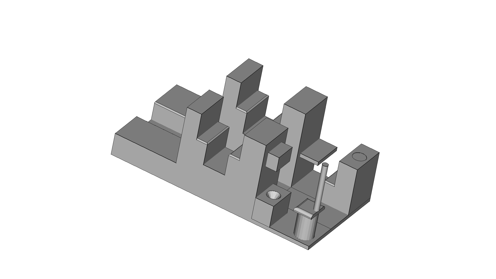

# Caboose

3D-printable caboose interior components for a model railroad caboose car.



## Parts

- **BobCabInterior** — Interior detail for Bob's caboose

## Quick Start

### Print Settings
| Setting | Value |
|---------|-------|
| Material | PETG |
| Printer | Prusa Core One |
| Supports | None |

## Project Structure

```
Caboose/
├── README.md              # This file
├── freecad/               # FreeCAD source files
│   └── BobCabInterior.FCStd
└── printed_files/         # STL exports
    └── BobCabInterior (Meshed).stl
```

## License

GNU General Public License v3.0 - see repository root.
