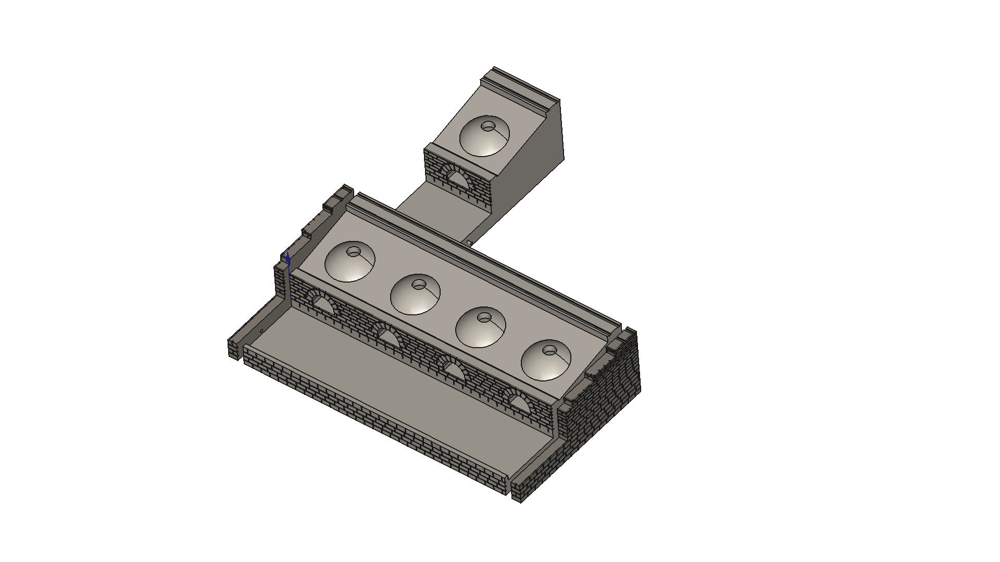

# CokeOvens

HO scale (1:87) modular bank coke oven scenic structure for a model railroad layout.
C&O Railway prototype, West Virginia coalfields, circa 1900.



## Parts

| Part | File | Description |
|------|------|-------------|
| **CokeOvenSection** | `CokeOven_Section_4ovens_v8.stl` | 4-oven section, 209.7 × 121.7 × 52.1 mm |
| **CokeOvenSection_1** | `CokeOven_Section_1oven_v8.stl` | 1-oven test piece, 54.7 × 121.7 × 52.1 mm |
| **EndCapStoneWall** | `CokeOven_EndCap_v8.stl` | Left bank end cap, 7 × 121.7 × 52.1 mm |
| **EndCapStoneWall_Mirror** | `CokeOven_EndCap_Mirror_v8.stl` | Right bank end cap (X-mirror) |

Sections butt-join end-to-end with alignment peg (right face) + hole (left face).
One end cap at each end of the assembled bank; end caps have a receiving hole on the mating face.

## Quick Start

### Print Settings
| Setting | Value |
|---------|-------|
| Material | PETG |
| Printer | Prusa Core One |
| Bed | 250 × 210 mm |
| Supports | None |
| Orientation | Back wall (+Y face) flat on bed |
| Brim | End caps only (7 mm face-down) |

### Generating STLs

Requires FreeCAD with the Robust MCP bridge running at `localhost:9875`:

```bash
# Via MCP bridge (from FreeCAD session)
python3 scripts/generate_cokeovens.py
```

Or load `freecad/CokeOvens.FCStd` directly in FreeCAD.

## Prototype

Bank-type beehive coke ovens, hand-fired with slack coal delivered by larry car on the
ridge track above. Ovens fire ~48–72 hours; coke drawn through the arch opening and
loaded into gondolas (bulk) or box cars (bagged coke) on the coke siding.

Based on HABS/HAER survey drawings, Connellsville Coal & Coke Region (Shoah Works,
pa2870 series) — identical beehive oven technology to C&O/New River Gorge operations.

## Key Dimensions (HO scale)

| Feature | Prototype | HO (mm) |
|---------|-----------|---------|
| Oven interior diameter | 12 ft | 42.1 |
| Oven center-to-center | 14 ft 9 in | 51.7 |
| Arch opening width | 5 ft | 17.5 |
| Front wall height | ~5 ft | 17.5 |
| Coke yard depth | 14 ft | 49.1 |
| Retaining wall height | 3 ft 6 in | 12.2 |
| Larry track gauge | N scale | 9.0 mm |

## Assembly

```
[EndCap_Mirror] [Section] [Section] ... [EndCap]
```

- Sections print as single fused solids — no supports needed
- Alignment peg (Ø2 mm × 3 mm) on section right face fits into hole (Ø2.3 mm × 3.5 mm) on adjacent section left face
- End cap holes receive section pegs or a separate metal alignment pin
- Bank length: each 4-oven section = 209.7 mm (~9.7 ft HO)

## Post-Print Checklist

- [ ] Stone course readability at arm's length (increase STONE_MORTAR 0.42→0.5 mm if needed)
- [ ] Voussoir arch joints visible (9 voussoirs + extrados groove + jamb joints)
- [ ] Arch plinth proportions — 2–3 visible courses between yard floor and spring line
- [ ] Larry track grooves (9 mm gauge, 1.8 × 0.9 mm) accept N-scale track ties flush
- [ ] Alignment peg/hole fit — adjust PEG_HOLE_R if too tight/loose

## Project Structure

```
CokeOvens/
├── README.md                     # This file
├── CLAUDE.md                     # Claude Code project instructions
├── docs/
│   └── DESIGN.md                 # Full technical specification
├── freecad/
│   └── CokeOvens.FCStd           # FreeCAD source document
├── images/
│   ├── cokeovens_iso.png         # CAD isometric view
│   └── service-pnp-habshaer-*.jpg  # HABS/HAER prototype drawings
├── printed_files/                # STL exports (v8 production)
│   ├── CokeOven_Section_4ovens_v8.stl
│   ├── CokeOven_Section_1oven_v8.stl
│   ├── CokeOven_EndCap_v8.stl
│   └── CokeOven_EndCap_Mirror_v8.stl
└── scripts/
    └── generate_cokeovens.py     # Parametric generation script (v8)
```

## License

GNU General Public License v3.0 — see repository root.
