# Station

FreeCAD designs for a model railroad station structure (NY&E layout, circa 1905).
Prototype basis: New Haven standard combination station (Fig. 172) adapted as a
freelanced C&O-prototype variation.

---

## SK (Stans Knob) Station — HO Scale 1:87

Site-specific variant for the SK location. Building depth constrained to 40mm
(standard is 52.6mm). All production STLs are complete.

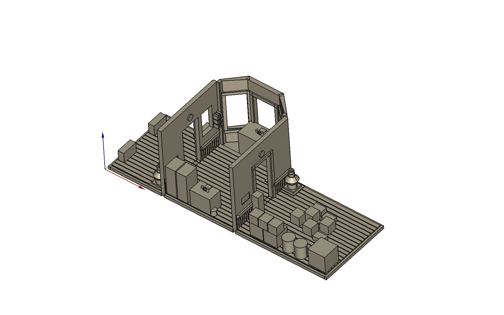

### Production prints

| STL | Script | Description |
|-----|--------|-------------|
| `SK_SidingWall.stl` | `generate_sk_siding_wall.py` | Siding face: #8033 waiting door, #8028/69 office window, #8125 freight door; wainscot, cap rail, interior frames, 45° miters |
| `SK_PassengerWall.stl` | `generate_sk_passenger_wall.py` | Passenger face: same doors, full bay opening; interior frames |
| `SK_GableWall.stl` | `generate_sk_gable_wall.py` | Both gable ends (print ×2): #8070 double window, 45° miters |
| `SK_FloorBasic.stl` | `generate_sk_floor_basic.py` | Floor + partition walls + bay (full interior detail); 0.15mm layer height |
| `SK_FloorBasic_Plain.stl` | `generate_sk_floor_basic.py` | Floor + partition walls + bay (no furniture); structural print only |
| `SK_CeilingFull.stl` | `generate_sk_ceiling_full.py` | Full-building lift-off ceiling: 4mm tin grid, 4 pendants, all wall channels, 24mm/11mm eaves |
| `SK_RoofPanel_Long.stl` | `generate_sk_roof_panels.py` | Trapezoidal roof backing panel ×2; 5:12 pitch wedge ribs; half-lap ridge tabs |
| `SK_RoofPanel_Hip.stl` | `generate_sk_roof_panels.py` | Triangular hip-end backing panel ×2 |
| `SK_Platform.stl` | `generate_sk_platform.py` | Freight platform: 126×88×17mm shell; NMRA Classic E=14mm |
| `SK_Platform_Passenger.stl` | `generate_sk_platform.py` | Passenger platform: 126×88×9mm shell; E=6mm |

### Key dimensions (SK)

| Element | Value |
|---------|-------|
| Building length | 116.6mm |
| Building depth (SK site limit) | 40.0mm |
| Wall height | 36.8mm (10'6") |
| Wall thickness | 2.0mm |
| Eave overhang — long faces | 24mm |
| Eave overhang — gable ends | 11mm |
| Roof pitch | 5:12 (~22°) |

### ISO views

| | |
|---|---|
| 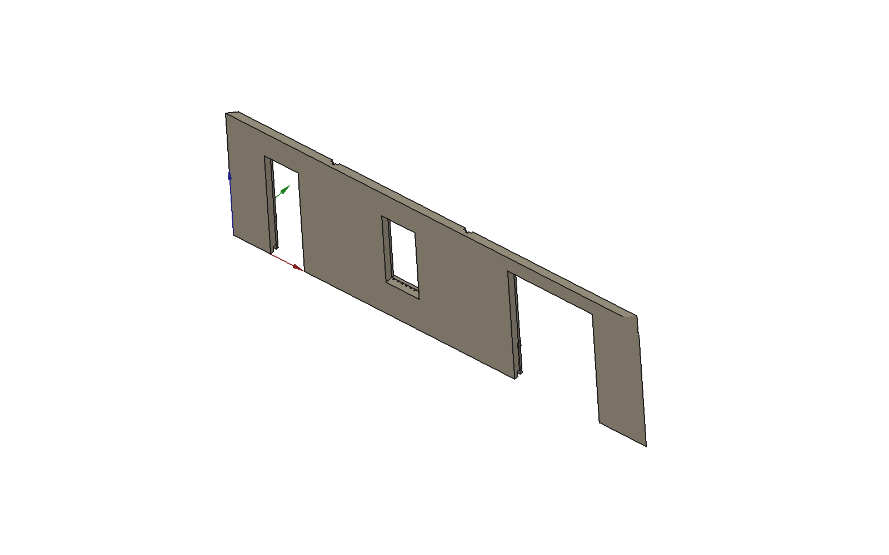 | 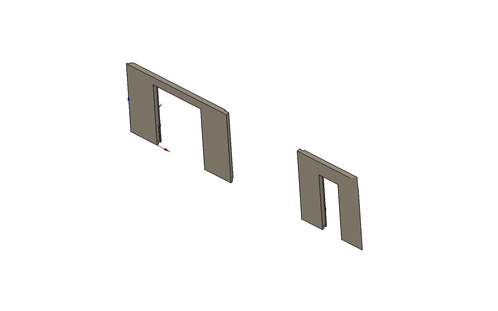 |
| Siding wall | Passenger wall |
| 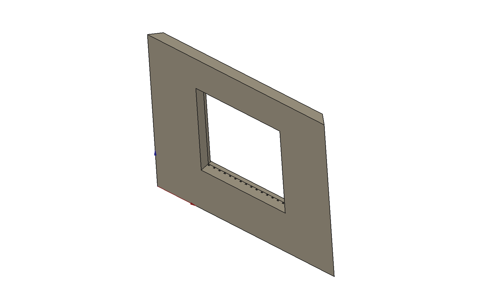 |  |
| Gable wall (print ×2) | Floor — plain variant |
| 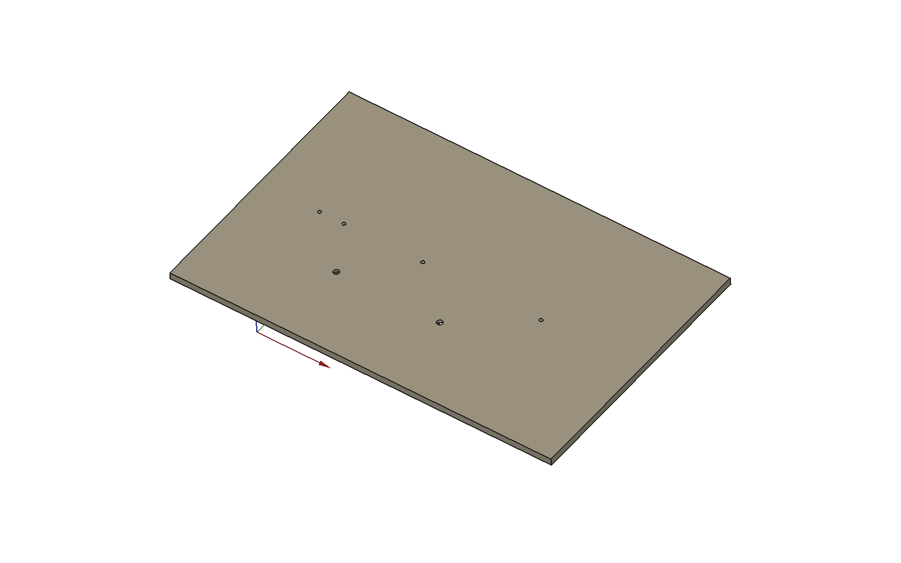 | 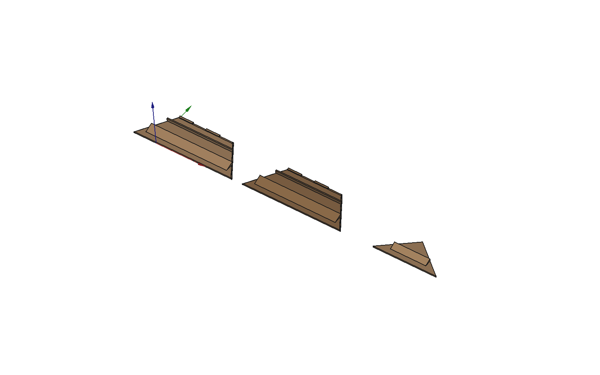 |
| Ceiling (top face shown) | Roof backing panels |
| 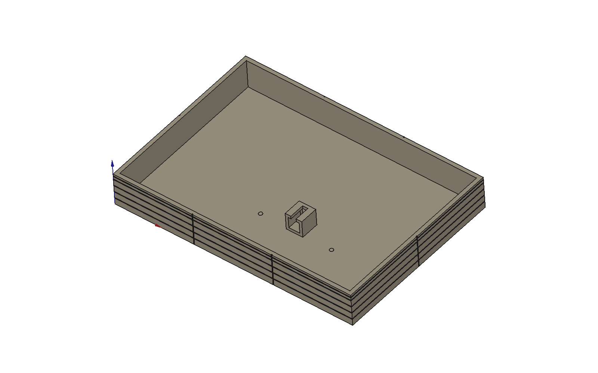 | 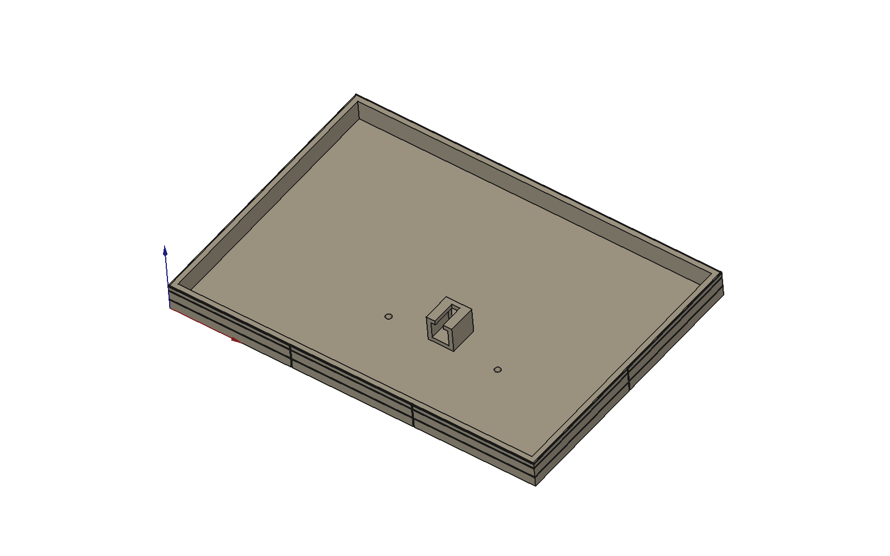 |
| Platform — freight | Platform — passenger |

See `docs/ASSEMBLY_GUIDE.md` for parts inventory, key dimensions, and assembly sequence.

---

## Standard Station — HO Scale 1:87

Full-prototype variant. Building depth 52.6mm (standard), full-size waiting room and freight
room, plus waiting-room and freight-room windows on both long faces.

### Production prints

| STL | Script | Description |
|-----|--------|-------------|
| `Std_SidingWall.stl` | `generate_std_siding_wall.py` | Siding face: W-window, #8033 waiting door, #8028/69 office window, F-window, #8038 freight door; wainscot, cap rail, interior frames |
| `Std_PassengerWall.stl` | `generate_std_passenger_wall.py` | Passenger face: same openings + full bay; interior frames |
| `Std_GableWall.stl` | `generate_std_gable_wall.py` | Both gable ends (print ×2): #8070 double window, 45° miters |
| `Std_FloorBasic.stl` | `generate_std_floor_basic.py` | Floor + partition walls + bay (full interior detail); 0.15mm layer height |
| `Std_FloorBasic_Plain.stl` | `generate_std_floor_basic.py` | Floor + partition walls + bay (no furniture); structural print only |
| `Std_CeilingFull.stl` | `generate_std_ceiling_full.py` | Full-building lift-off ceiling: 4mm tin grid, 4 pendants, all wall channels, 24mm/11mm eaves |
| `Std_RoofPanel_Long.stl` | `generate_std_roof_panels.py` | Trapezoidal roof backing panel ×2; 5:12 pitch wedge rib; half-lap ridge tabs |
| `Std_RoofPanel_Hip.stl` | `generate_std_roof_panels.py` | Triangular hip-end backing panel ×2 |
| `Std_Platform.stl` | `generate_std_platform.py` | Freight platform orient-A: 199.6×100.6×17mm; waiting end at X=0; NMRA Classic E=14mm |
| `Std_Platform_B.stl` | `generate_std_platform.py` | Freight platform orient-B: same dims; freight end at X=0 (mirror) |
| `Std_Platform_Passenger.stl` | `generate_std_platform.py` | Passenger platform orient-A: 199.6×100.6×9mm; E=6mm |
| `Std_Platform_B_Passenger.stl` | `generate_std_platform.py` | Passenger platform orient-B: mirror |

### Key dimensions (Standard)

| Element | Value |
|---------|-------|
| Building length | 189.6mm |
| Building depth | 52.6mm |
| Waiting room | ft(15,2) = 53.1mm |
| Ticket office | ft(10,2) = 35.6mm *(same as SK)* |
| Freight room | ft(26,6) = 92.8mm |
| Wall height | 36.8mm (10'6") |
| Wall thickness | 2.0mm |
| Eave overhang — long faces | 24mm |
| Eave overhang — gable ends | 11mm |
| Roof pitch | 5:12 (~22°) |
| Ridge height | 10.95mm |

### ISO views

| | |
|---|---|
| 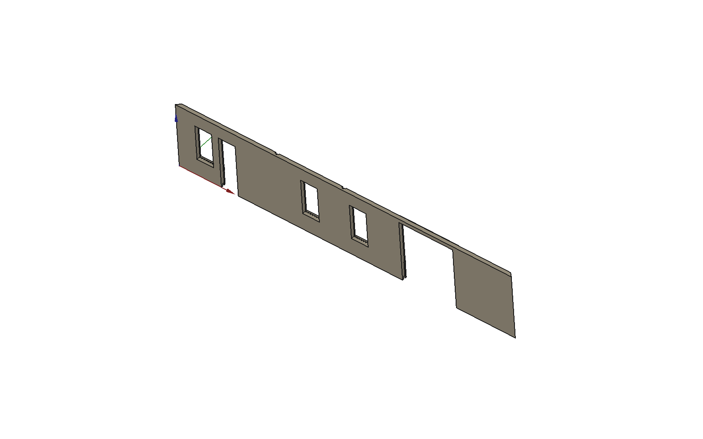 | 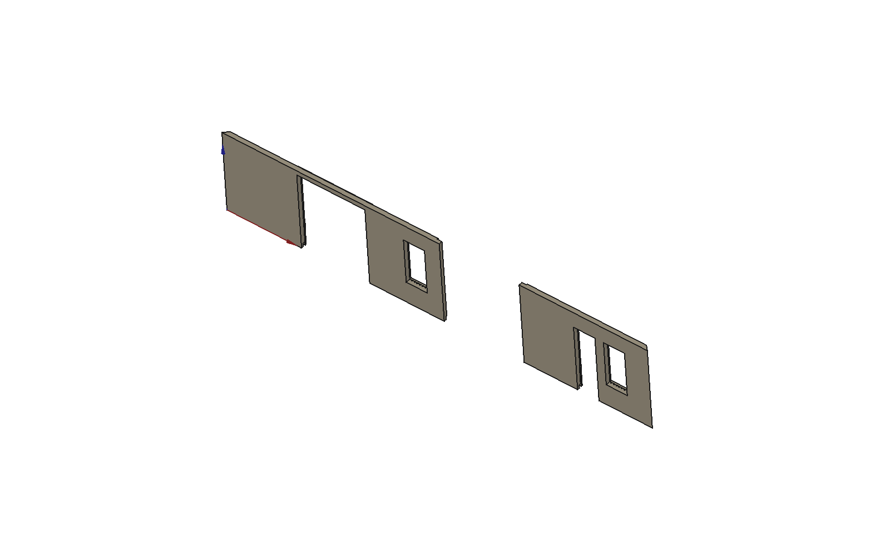 |
| Siding wall | Passenger wall |
| 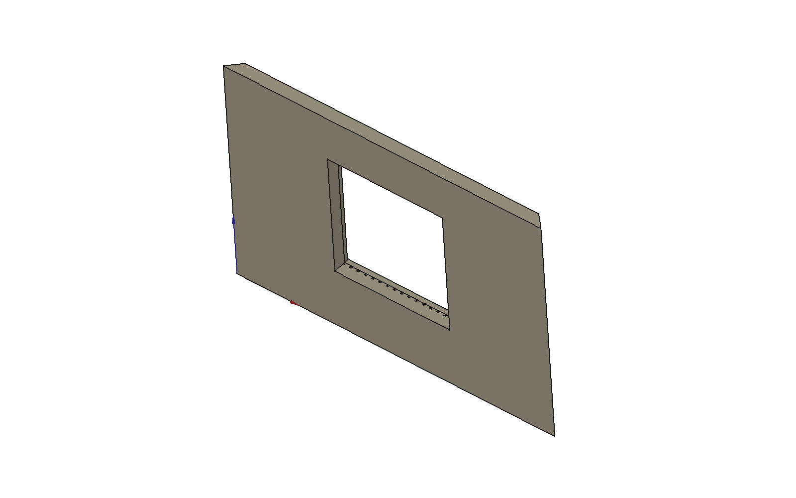 | 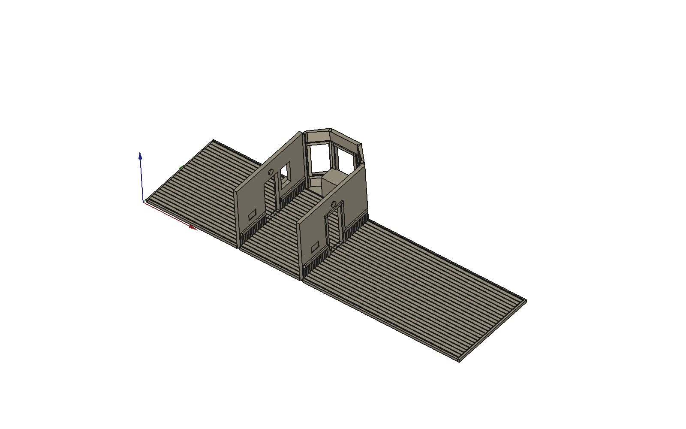 |
| Gable wall (print ×2) | Floor — plain variant |
| 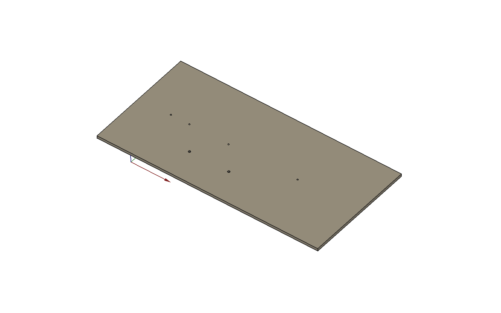 | 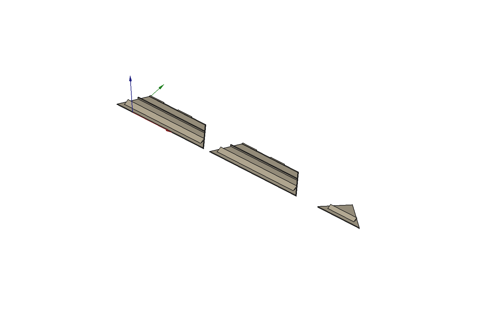 |
| Ceiling (top face shown) | Roof backing panels |
| 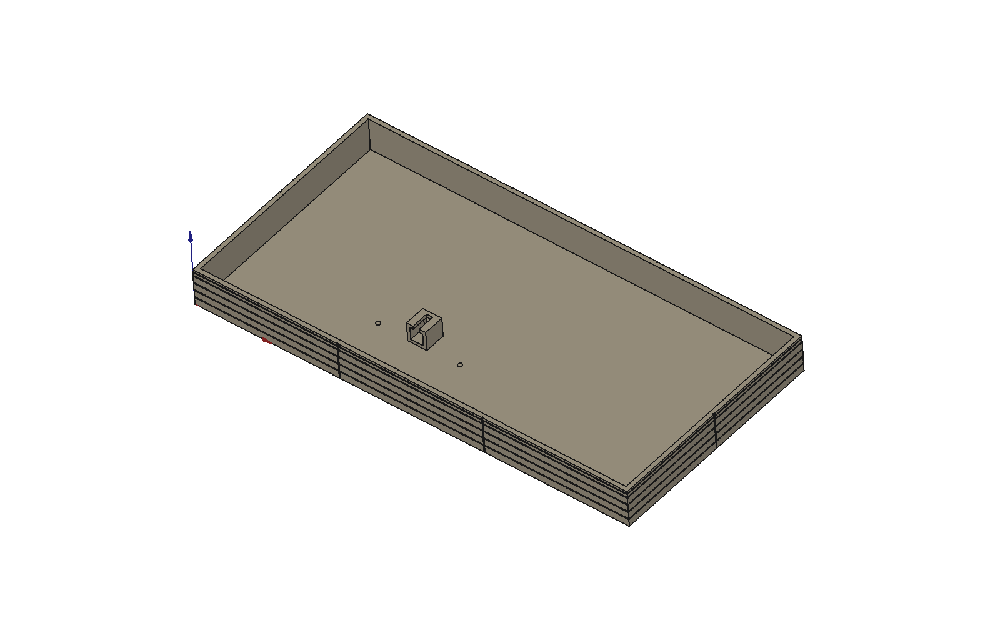 | 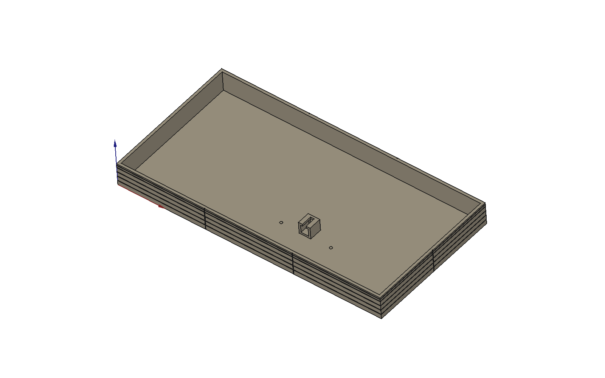 |
| Platform A — freight (waiting@X=0) | Platform B — freight (freight@X=0) |

See `docs/ASSEMBLY_GUIDE.md` for parts inventory and assembly sequence.

---

## Planning Token

Two-piece planning model for layout footprint placement. Print and use on the layout
before committing to the detail build.

**Three prints** (in `printed_files/archive/`):

| File | Description |
|------|-------------|
| `StationPlan_Building_A.stl` | Building shell — freight room left, waiting room right |
| `StationPlan_Building_B.stl` | Building shell — waiting room left, freight room right (mirror) |
| `StationPlan_Platform.stl`   | Platform slab — symmetric, slot accepts either building |

---

## Project Structure

```
Station/
├── README.md
├── docs/
│   ├── ASSEMBLY_GUIDE.md         # parts inventory, key dims, assembly sequence
│   └── STATION_PLANNING_GUIDE.md # build decisions, test print history, session log
├── scripts/
│   ├── generate_sk_siding_wall.py      # SK — siding wall
│   ├── generate_sk_passenger_wall.py   # SK — passenger wall
│   ├── generate_sk_gable_wall.py       # SK — gable ends
│   ├── generate_sk_floor_basic.py      # SK — floor + interior
│   ├── generate_sk_ceiling_full.py     # SK — full ceiling
│   ├── generate_sk_roof_panels.py      # SK — roof backing panels
│   ├── generate_sk_platform.py         # SK — trackside platforms
│   ├── generate_std_siding_wall.py     # Standard — siding wall
│   ├── generate_std_passenger_wall.py  # Standard — passenger wall
│   ├── generate_std_gable_wall.py      # Standard — gable ends
│   ├── generate_std_floor_basic.py     # Standard — floor + interior
│   ├── generate_std_ceiling_full.py    # Standard — full ceiling
│   ├── generate_std_roof_panels.py     # Standard — roof backing panels
│   ├── generate_std_platform.py        # Standard — trackside platforms (A/B orientation)
│   ├── generate_sk_iso_views.py        # ISO screenshot generator (SK + Standard)
│   ├── generate_stationplantoken.py    # Standard planning token
│   ├── generate_stationsk.py           # SK planning token
│   └── archive/                        # Superseded test scripts
├── freecad/                            # FCStd source files
├── images/                             # ISO renders
└── printed_files/
    ├── SK_SidingWall.stl
    ├── SK_PassengerWall.stl
    ├── SK_GableWall.stl
    ├── SK_FloorBasic.stl
    ├── SK_FloorBasic_Plain.stl
    ├── SK_CeilingFull.stl
    ├── SK_RoofPanel_Long.stl
    ├── SK_RoofPanel_Hip.stl
    ├── SK_Platform.stl
    ├── SK_Platform_Passenger.stl
    ├── Std_SidingWall.stl
    ├── Std_PassengerWall.stl
    ├── Std_GableWall.stl
    ├── Std_FloorBasic.stl
    ├── Std_FloorBasic_Plain.stl
    ├── Std_CeilingFull.stl
    ├── Std_RoofPanel_Long.stl
    ├── Std_RoofPanel_Hip.stl
    ├── Std_Platform.stl
    ├── Std_Platform_B.stl
    ├── Std_Platform_Passenger.stl
    ├── Std_Platform_B_Passenger.stl
    └── archive/                        # Planning tokens, test pieces
```

## License

GNU General Public License v3.0 — see repository root.
