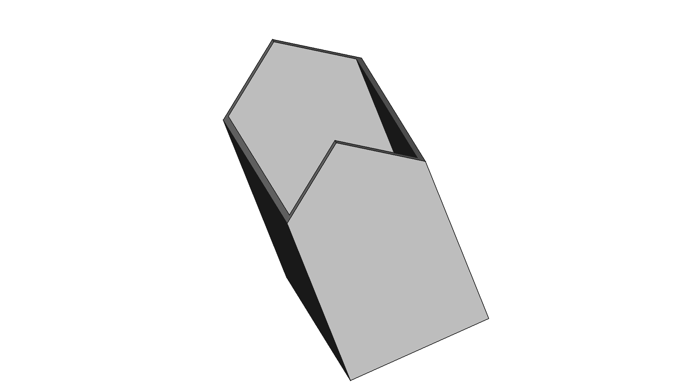

# Station

FreeCAD design for a model railroad station structure.



## Quick Start

### Print Settings
| Setting | Value |
|---------|-------|
| Material | PETG |
| Printer | Prusa Core One |
| Supports | TBD |

## Project Structure

```
Station/
├── README.md              # This file
└── freecad/               # FreeCAD source files
    └── Station.FCStd
```

## License

GNU General Public License v3.0 - see repository root.
